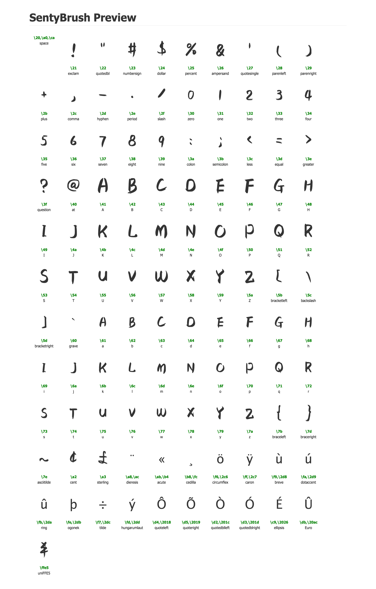

fontmin-dump
===

[![Build Status][travis-image]][travis-url]
[![NPM version][npm-image]][npm-url]
[![Downloads][downloads-image]][npm-url]
[![Dependencies][dep-image]][dep-url]


> fontmin dump plugin


## Usage

```javascript
var Fontmin = require('fontmin');
var dump = require('fontmin-dump');

var fontmin = new Fontmin()
    .src('font.ttf')
    .use(dump())

// => font.json, font.html

```

## Preview



## Related

- [fontmin](https://github.com/ecomfe/fontmin)
- [SentyBrush](http://sentyfont.com)

[travis-url]: https://travis-ci.org/junmer/fontmin-dump
[travis-image]: http://img.shields.io/travis/junmer/fontmin-dump.svg
[downloads-image]: http://img.shields.io/npm/dm/fontmin-dump.svg
[npm-url]: https://npmjs.org/package/fontmin-dump
[npm-image]: http://img.shields.io/npm/v/fontmin-dump.svg
[dep-url]: https://david-dm.org/junmer/fontmin-dump
[dep-image]: http://img.shields.io/david/junmer/fontmin-dump.svg
